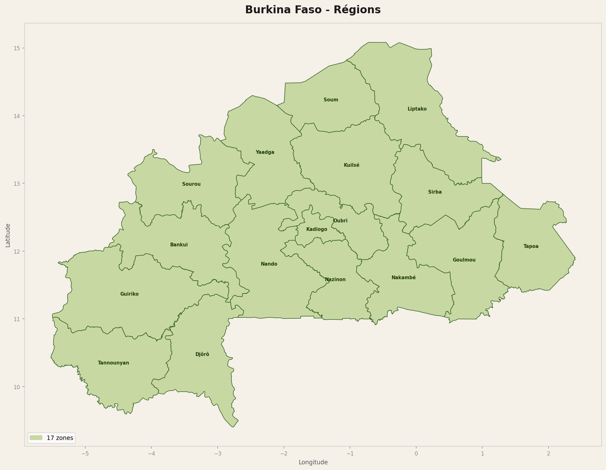
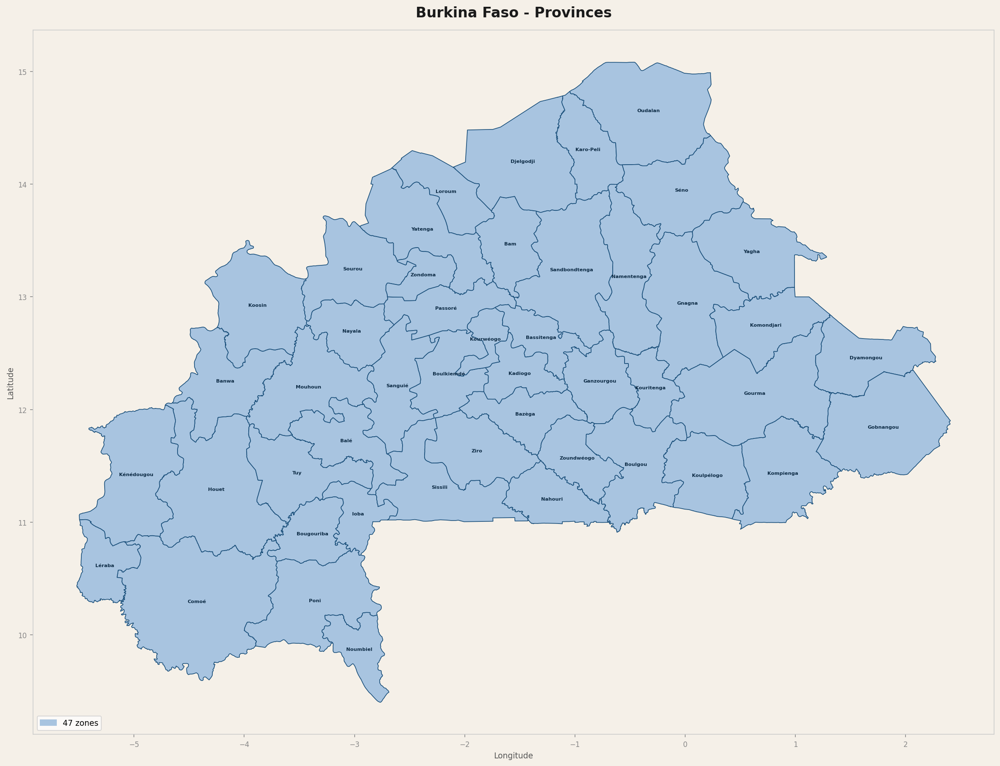

# Tableau de bord RSU, Burkina Faso

**Auteur :** Samson Koffi AWOUTO, ISE3, ENSAE Dakar
**Technologies :** Python, Flask, React, GeoPandas
**Dépôt :** [github.com/Awoutokoffisamson/rsu-dashboard](https://github.com/Awoutokoffisamson/rsu-dashboard)

---

## Description

Application web de suivi du Registre Social Unique (RSU) du Burkina Faso. Elle permet de visualiser la couverture RSU par région, province et commune, et d'exporter les données filtrées.

Le projet fait suite à une version R Shiny et constitue une réécriture complète en Python et React.

---

## Fonctionnalités

- Carte interactive avec navigation par niveaux administratifs (régions, provinces, communes)
- Drilldown : cliquer sur une région affiche ses provinces, puis ses communes
- Filtres par région, province et année RSU
- Statut de couverture par zone : Couverte, Partiellement couverte, Pas couverte
- Tableau dynamique et graphiques d'analyse
- Export Excel et GeoJSON des données filtrées
- Authentification avec gestion des rôles

---

## Architecture

| Composant | Stack |
|---|---|
| Backend | Python 3.11, Flask, GeoPandas, Shapely, SQLAlchemy |
| Frontend | React, Axios, Leaflet |
| Données géographiques | Shapefiles Burkina Faso, trois niveaux |
| Déploiement | Docker, Hugging Face Spaces, Netlify |

---

## Aperçu

### Tableau de bord

### Carte interactive

### Analyse

---

## Cartes géographiques

| Carte | Description |
|---|---|
|  | 17 régions du Burkina Faso |
|  | 47 provinces |

---

## Données

Les données RSU sont confidentielles et ne sont pas incluses dans ce dépôt. Seuls les shapefiles géographiques publics sont versionnés.
